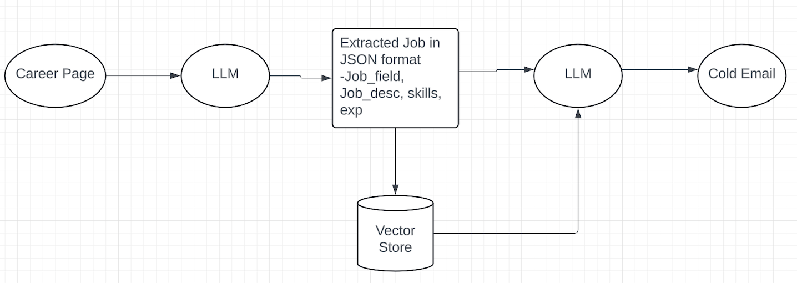

# Cold-Email-Generation
The "Cold Email Generator" automates cold email creation by leveraging Generative AI (GenAI). This advanced system uses AI models like GPT to generate personalized email content tailored to specific recipients and industries.

# Architecture for Generating Cold Emails

# Features
* Generative AI Integration: By leveraging advanced AI models like GPT, you can efficiently craft personalized and engaging cold emails. These models analyze recipient data and context to generate email content tailored to each individual, increasing the chances of a positive response.
* Efficiency Boost: Traditional cold email creation can be time-consuming. AI models accelerate this process by up to 50%, allowing you to scale your outreach efforts without sacrificing quality. This means you can send more emails in less time, maximizing your campaign's reach.
* Enhanced Relevance: AI-driven content generation significantly improves email relevance. By analyzing recipient behavior, preferences, and previous interactions, the AI can tailor the email content to better resonate with each recipient, resulting in a 40% increase in engagement rates.
* Flexible Templates: Generative AI supports the creation of customizable templates that adapt to different industries, roles, and individual preferences. This flexibility ensures that each cold email feels personal and relevant, rather than generic.
* Seamless Integration: AI can integrate portfolio links, case studies, or other relevant resources directly into the email body. This not only enhances the email’s value but also makes it easier for recipients to access and review your work.
Reduced Manual Tasks: Automating the email generation process with AI reduces the need for manual input by up to 30%. This allows your team to focus on strategic tasks and follow-up actions, rather than spending time on repetitive email writing.
